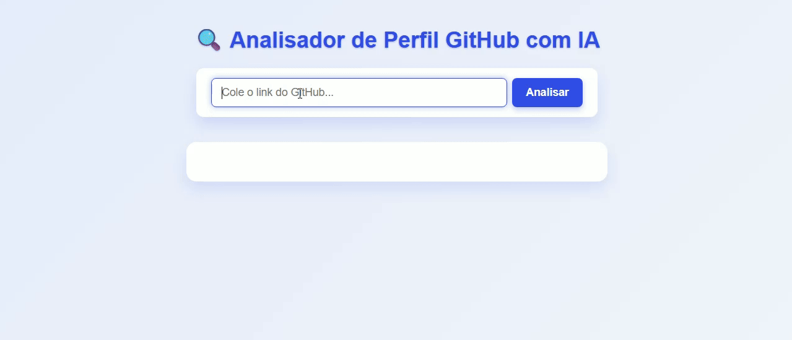

# 🔍 GitHub Analisador com IA – Projeto de TCC

Projeto desenvolvido como Trabalho de Conclusão de Curso (TCC) em Ciência da Computação.  
Objetivo: facilitar a análise automatizada de perfis públicos no GitHub para **recrutadores**, **avaliadores técnicos** e interessados em obter insights rápidos e precisos.

---

## 🖼️ Demonstração

---

## ⚠️ Status do Projeto

Em desenvolvimento ativo. Funcionalidades podem mudar e bugs podem aparecer.  
Contribuições, sugestões e feedbacks são super bem-vindos!

---

## ✅ Funcionalidades Principais

- 📊 Extração automática de dados públicos do GitHub: bio, seguidores, repositórios, linguagens usadas, estrelas, etc.
- 💬 Geração de relatório técnico em HTML, com avaliação clara e estruturada do perfil.
- 💡 Sugestões inteligentes para aprimorar o perfil e os projetos.
- 🧠 Uso da API OpenAI GPT para análise avançada e geração de textos personalizados.
- 🌐 Interface web simples, responsiva e amigável.

---

## 🧱 Arquitetura e Tecnologias

| Camada       | Tecnologias Utilizadas                        |
|--------------|-----------------------------------------------|
| Backend      | Python + FastAPI + OpenAI GPT API             |
| Frontend     | HTML, CSS, JavaScript                         |
| API Externa  | GitHub API                                    |
| IA           | OpenAI GPT (chat completions)                 |
| Middleware   | CORS, python-dotenv                           |

---

## 🌐 Fluxo de Funcionamento

1. Usuário insere o perfil GitHub no site.
2. Frontend envia requisição para o backend.
3. Backend consulta a API do GitHub e coleta dados públicos.
4. Backend usa a API OpenAI GPT para gerar análise técnica personalizada em HTML.
5. Resultado é exibido na página para avaliação imediata.

---

## 🧪 Tecnologias Utilizadas

- **FastAPI:** API backend rápida e moderna.
- **PyGithub:** Cliente para integração com GitHub API.
- **OpenAI GPT API:** Geração de textos inteligentes e análise de perfil.
- **python-dotenv:** Variáveis de ambiente seguras.
- **HTML/CSS/JS:** Frontend leve e responsivo.
- **GitHub API:** Consulta oficial e confiável de dados públicos.
- **CORS:** Segurança na comunicação frontend-backend.

---

## 📁 Estrutura do Projeto

github-analisador/
├── backend/
│ ├── main.py # API FastAPI e lógica principal
│ ├── requirements.txt # Dependências Python
│ ├── .env # Variáveis sensíveis (não commitadas)
│
├── frontend/
│ ├── index.html # Interface web principal
│ ├── style.css # Estilos da aplicação
│ └── script.js # Scripts para interação e requisição
│
├── .gitignore # Arquivos ignorados pelo Git
└── README.md # Documentação do projeto

---

## 🔐 Segurança

- Token da OpenAI e GitHub configurados via `.env`, nunca versionados.
- Informações sensíveis protegidas por `.gitignore`.
- CORS configurado para comunicação segura entre frontend e backend.

---

## 📌 Observações

- Ideal para uso local e demonstrações acadêmicas.
- Preparado para futuras melhorias com IA e banco vetorial.
- Não requer deploy para funcionar.

---

## 👨‍💻 Autor

**João Paulo Leôncio** — Desenvolvedor e estudante de Ciência da Computação.  
[GitHub](https://github.com/LeoncioDev) | [LinkedIn](https://www.linkedin.com/in/jo%C3%A3o-paulo-le%C3%B4ncio-78071627b/)

